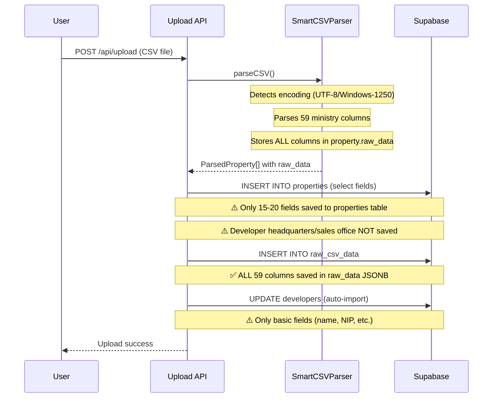
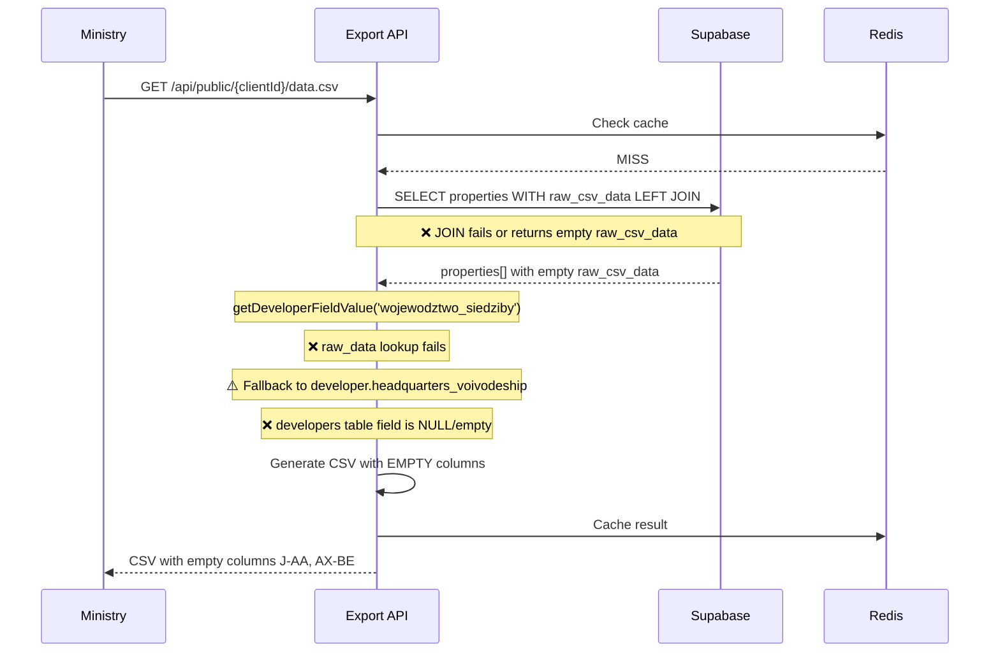
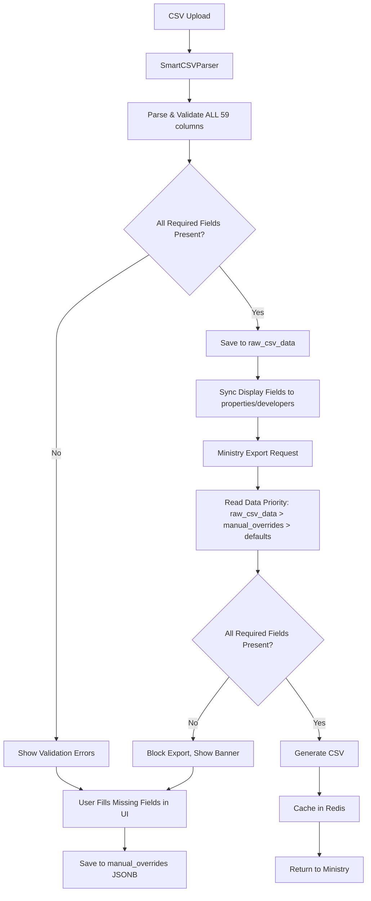

# PRD: Raw CSV Data Architecture Redesign - Complete Ministry Compliance System

**Date**: 2025-10-14
**Status**: Draft
**Priority**: P0 (Critical - Ministry Compliance)
**Author**: Claude Code Analysis

---

## 🎯 Executive Summary

### Problem Statement

Currently, ministerial CSV exports (columns J-AA for developer data, AX-BE for property data) are **empty or incorrect** because:

1. **Data Source Mismatch**: Export code looks for data in `developers` and `properties` tables, but these tables are often empty or incomplete after CSV upload
2. **Fallback Logic Fails**: When `raw_csv_data` lookups fail, fallbacks to database tables return empty values
3. **No Data Validation**: System doesn't detect or warn about missing required ministerial fields before export
4. **No Merge Strategy**: Re-uploads don't properly handle existing properties (should mark as sold)
5. **Manual Edits Lost**: No mechanism to preserve manual edits in app when CSV is re-uploaded

### Root Cause Analysis

**Current broken flow**:
```
CSV Upload
  ↓
SmartCSVParser stores ALL columns in raw_csv_data.raw_data (✅ WORKS)
  ↓
Upload route saves to properties + developers tables (⚠️ INCOMPLETE - many fields skipped)
  ↓
Ministry Export reads from raw_csv_data (✅ WORKS)
  ↓
BUT: raw_csv_data JOIN fails OR raw_data object is empty (❌ BUG)
  ↓
Fallback to developers/properties tables (⚠️ EMPTY FIELDS)
  ↓
Result: EMPTY COLUMNS in exported CSV
```

**Evidence**:
- User uploaded CSV has data: `email=chudziszewski221@gmail.com`
- Exported CSV shows different email from `developers.email` database field
- Columns 10-28 (developer headquarters/sales office) are empty in export
- Columns 52-58 (necessary rights, other services) are empty in export

### Solution Overview

**New architecture with 3-tier data priority**:

```
TIER 1: raw_csv_data (source of truth for ministry exports)
  ↓ (if empty)
TIER 2: manual_overrides (user-edited fields in app UI)
  ↓ (if empty)
TIER 3: defaults (fallback values)
```

**Key principles**:
1. **Ministry Export Priority**: raw_csv_data → manual_overrides → defaults → NEVER from properties/developers tables
2. **Dashboard Display Priority**: properties/developers tables (for analytics) → raw_csv_data (read-only reference)
3. **Manual Edits Persistence**: Save to new `manual_overrides` JSONB column in properties table
4. **Upload Behavior**: CSV overwrites raw_csv_data, preserves manual_overrides
5. **Validation Before Export**: Block export if required fields missing, show banner with count

---

## 📊 Current System Flow Analysis

### Upload Flow (✅ Partially Working)



**SmartCSVParser.ts Line 1335** (✅ WORKS):
```typescript
// Stores ALL columns with ORIGINAL header names
this.headers.forEach((header, index) => {
  if (index < row.length) {
    property.raw_data[header] = row[index] || ''
  }
})
```

**Result**: `raw_data` contains complete CSV data with keys like:
```json
{
  "wojewodztwo_siedziby": "pomorskie",
  "nazwa_dewelopera": "TAMBUD...",
  "email": "chudziszewski221@gmail.com",
  ...all 59 columns...
}
```

### Export Flow (❌ BROKEN)



**data.csv/route.ts Line 212** (❌ BUG SOURCE):
```typescript
const getDeveloperFieldValue = (...) => {
  const rawData = firstProperty?.raw_csv_data?.[0]?.raw_data || {}

  // ❌ If raw_csv_data is empty array or JOIN failed:
  // rawData = {} (empty object)
  // All lookups return undefined
  // Falls back to empty developer table fields
}
```

**Hypothesis**: The `raw_csv_data` LEFT JOIN is returning empty array or the `raw_data` JSONB is null/empty.

---

## 🎨 Desired System Architecture

### New Data Flow



### Database Schema Changes

**New Table: manual_overrides**
```sql
CREATE TABLE manual_overrides (
  id UUID PRIMARY KEY DEFAULT gen_random_uuid(),
  property_id UUID REFERENCES properties(id) ON DELETE CASCADE,
  field_name TEXT NOT NULL, -- ministerial field name
  field_value TEXT,
  edited_by UUID REFERENCES auth.users(id),
  edited_at TIMESTAMPTZ DEFAULT NOW(),

  UNIQUE(property_id, field_name)
);
```

**Alternative: Add JSONB column to properties**
```sql
ALTER TABLE properties
ADD COLUMN manual_overrides JSONB DEFAULT '{}';

-- Example data:
{
  "wojewodztwo_siedziby": "mazowieckie",
  "email": "contact@developer.com",
  "parking_price": "50000"
}
```

### Data Priority System

**3-Tier Lookup Logic** (replace current getDeveloperFieldValue + getFieldValue):

```typescript
/**
 * Universal field getter with 3-tier priority
 * @param ministryFieldName - Full ministerial column name (e.g., "wojewodztwo_siedziby")
 * @param property - Property object with raw_csv_data and manual_overrides
 * @param developer - Developer object (for developer-specific fields)
 * @param defaultValue - Fallback if all tiers empty
 */
function getMinistryFieldValue(
  ministryFieldName: string,
  property: PropertyWithRawData,
  developer?: Developer,
  defaultValue: string = ''
): string {
  // TIER 1: Manual overrides (highest priority - user edited in app)
  const manualOverride = property.manual_overrides?.[ministryFieldName]
  if (manualOverride !== undefined && manualOverride !== null && manualOverride !== '') {
    return String(manualOverride)
  }

  // TIER 2: Raw CSV data (source of truth from upload)
  const rawData = property.raw_csv_data?.[0]?.raw_data || {}
  const rawValue = rawData[ministryFieldName]
  if (rawValue !== undefined && rawValue !== null && rawValue !== '') {
    return String(rawValue)
  }

  // TIER 2b: Developer-level fields (if applicable)
  // For fields like company name, NIP, etc. that are same across all properties
  if (developer && isDeveloperField(ministryFieldName)) {
    const devRawData = developer.raw_csv_data?.[0]?.raw_data || {}
    const devRawValue = devRawData[ministryFieldName]
    if (devRawValue !== undefined && devRawValue !== null && devRawValue !== '') {
      return String(devRawValue)
    }
  }

  // TIER 3: Default value
  return defaultValue
}
```

**Important**: NEVER read from `properties.*` or `developers.*` table columns for ministry export (except `manual_overrides`).

---

## ✅ Required Ministerial Fields (Ministry Schema 1.13)

### Developer Fields (Columns 1-28)

**Always Required** (cannot be empty):
1. `nazwa_dewelopera` - Developer name
2. `forma_prawna` - Legal form
5. `nip` - Tax ID
6. `regon` - Statistical ID
7. `telefon` - Phone
8. `email` - Email

**Conditionally Required**:
3. `nr_krs` - Required if legal form = "Spółka" (company)
4. `nr_ceidg` - Required if legal form != "Spółka" (sole proprietorship)

**Optional but Recommended**:
- `nr_faxu` (9) - Fax (can be empty)
- `adres_strony_www` (10) - Website
- Headquarters address (11-18)
- Sales office address (19-26)
- `dodatkowe_lokalizacje_sprzedazy` (27) - Additional sales locations
- `sposob_kontaktu` (28) - Contact method

### Property Fields (Columns 29-58)

**Always Required**:
29-35. Investment location (województwo, powiat, gmina, miejscowość, ulica, nr budynku, kod pocztowy)
36. `rodzaj_nieruchomosci` - Property type
37. `nr_lokalu` - Apartment number
38. `cena_za_m2` - Price per m²
39. `data_obowiazywania_ceny_m2` - Price valid from date

**Conditionally Required**:
40-43. Base price OR final price (at least one must be filled)
  - `cena_bazowa` + `data_obowiazywania_ceny_bazowej`
  - OR `cena_koncowa` + `data_obowiazywania_ceny_koncowej`

**Optional**:
44-51. Parking spaces (rodzaj, oznaczenie, cena, data)
48-51. Storage rooms (rodzaj, oznaczenie, cena, data)
52-54. Necessary rights (wyszczególnienie, cena, data)
55-57. Other services (wyszczególnienie, cena, data)
58. `adres_prospektu` - Prospectus URL

### Validation Rules

**Format Validation**:
- `kod_pocztowy_*`: Must match XX-XXX pattern (e.g., "84-230")
- `nip`: Must be 10 digits
- `regon`: Must be 9 or 14 digits
- `email`: Must be valid email format
- `telefon`: Must be valid Polish phone (9 digits after optional +48)
- Dates: YYYY-MM-DD format
- Prices: Numeric, max 2 decimal places

**Business Logic Validation**:
- If property type = "mieszkanie", must have powierzchnia (area)
- At least ONE price field must be filled (cena_za_m2 OR cena_bazowa OR cena_koncowa)
- Date fields cannot be in the future
- NIP + REGON must be unique per developer

---

## 🚀 Implementation Plan

### Phase 1: Fix Current Export Bug (Quick Win)

**Goal**: Make raw_csv_data lookups work properly

**Tasks**:
1. Debug why `raw_csv_data` LEFT JOIN returns empty
   - Add console.log in export route to check `firstProperty.raw_csv_data`
   - Verify data exists in database: `SELECT * FROM raw_csv_data LIMIT 10`

2. Fix JOIN or query if broken
   - Ensure `is_latest = true` filter works
   - Verify foreign key relationship exists

3. Add extensive logging
   - Log when raw_data lookup succeeds/fails
   - Log fallback values used

4. Test with user's CSV file

**Estimated Time**: 2-4 hours
**Priority**: P0 (blocks ministry compliance)

### Phase 2: Add manual_overrides Column

**Goal**: Enable manual edits that persist across re-uploads

**Tasks**:
1. Add migration:
```sql
ALTER TABLE properties
ADD COLUMN manual_overrides JSONB DEFAULT '{}';

CREATE INDEX idx_properties_manual_overrides
ON properties USING gin(manual_overrides);
```

2. Update export route to use 3-tier priority (Tier 1: manual_overrides)

3. Create API endpoint for bulk edit:
```typescript
POST /api/properties/bulk-update-fields
{
  "propertyIds": ["uuid1", "uuid2"],
  "fieldUpdates": {
    "wojewodztwo_siedziby": "mazowieckie",
    "parking_price": "50000"
  }
}
```

4. Add UI for editing missing fields (see Phase 4)

**Estimated Time**: 1 day
**Priority**: P0

### Phase 3: Missing Fields Detection API

**Goal**: Identify properties with missing required ministerial fields

**Tasks**:
1. Create validation service:
```typescript
// src/lib/ministry-validation.ts

interface ValidationResult {
  propertyId: string
  apartmentNumber: string
  missingFields: {
    fieldName: string
    displayName: string
    category: 'developer' | 'investment' | 'property' | 'pricing'
    severity: 'required' | 'recommended' | 'optional'
  }[]
  validationErrors: {
    fieldName: string
    error: string // e.g., "Invalid postal code format"
  }[]
}

export function validateProperty(
  property: PropertyWithRawData,
  developer: Developer
): ValidationResult {
  const missing: ValidationResult['missingFields'] = []
  const errors: ValidationResult['validationErrors'] = []

  // Check all required fields
  const requiredFields = [
    { name: 'wojewodztwo_inwestycji', display: 'Województwo', category: 'investment' },
    { name: 'cena_za_m2', display: 'Cena za m²', category: 'pricing' },
    // ...all required fields
  ]

  for (const field of requiredFields) {
    const value = getMinistryFieldValue(field.name, property, developer)
    if (!value) {
      missing.push({
        fieldName: field.name,
        displayName: field.display,
        category: field.category as any,
        severity: 'required'
      })
    }
  }

  // Format validation
  const kodPocztowy = getMinistryFieldValue('kod_pocztowy_inwestycji', property)
  if (kodPocztowy && !/^\d{2}-\d{3}$/.test(kodPocztowy)) {
    errors.push({
      fieldName: 'kod_pocztowy_inwestycji',
      error: 'Invalid format. Expected: XX-XXX (e.g., 84-230)'
    })
  }

  // NIP validation (10 digits)
  const nip = getMinistryFieldValue('nip', property, developer)
  if (nip && !/^\d{10}$/.test(nip.replace(/[^0-9]/g, ''))) {
    errors.push({
      fieldName: 'nip',
      error: 'NIP must be 10 digits'
    })
  }

  return {
    propertyId: property.id,
    apartmentNumber: property.apartment_number || 'N/A',
    missingFields: missing,
    validationErrors: errors
  }
}
```

2. Create API endpoint:
```typescript
GET /api/validation/missing-fields?developerId={id}

Response:
{
  "totalProperties": 150,
  "propertiesWithIssues": 45,
  "missingFieldsSummary": {
    "wojewodztwo_siedziby": 45,  // 45 properties missing this field
    "parking_price": 30,
    "kod_pocztowy_inwestycji": 12
  },
  "details": [
    {
      "propertyId": "uuid",
      "apartmentNumber": "A1/5",
      "missingFields": [...],
      "validationErrors": [...]
    }
  ]
}
```

**Estimated Time**: 1 day
**Priority**: P0

### Phase 4: Dashboard UI - Missing Fields Banner & Bulk Edit

**Goal**: Show warning banner with missing fields count, enable bulk editing

**UI Mockup**:
```
┌─────────────────────────────────────────────────────────┐
│ ⚠️  45 properties have missing required fields          │
│                                                         │
│ Missing fields: wojewodztwo_siedziby (45),             │
│                 parking_price (30),                     │
│                 kod_pocztowy_inwestycji (12)            │
│                                                         │
│ [View Details] [Bulk Edit] [Dismiss]                   │
└─────────────────────────────────────────────────────────┘
```

**Tasks**:
1. Add banner component to developer dashboard
2. Fetch `/api/validation/missing-fields` on dashboard load
3. "View Details" button → open modal with table:
   - Column 1: Apartment Number
   - Column 2: Missing Fields (badges)
   - Column 3: Actions ([Edit])

4. "Bulk Edit" modal:
   - Select field to edit (dropdown)
   - Enter value (input)
   - Select properties to apply to (checkboxes or "Apply to all")
   - [Save] button → POST /api/properties/bulk-update-fields

5. Update banner count in real-time after bulk edit

**Estimated Time**: 2 days
**Priority**: P1

### Phase 5: Re-Upload Merge Strategy

**Goal**: Handle CSV re-uploads intelligently

**Behavior**:
1. **Matching Logic**: Match by `apartment_number` + `investment_address` (fuzzy match)
2. **For Matched Properties**:
   - Update `raw_csv_data` with new CSV data
   - Preserve `manual_overrides` (user edits NOT overwritten)
   - Update `status` if prices changed to "X" (mark as sold)
3. **For New Properties in CSV**:
   - Insert as new properties
4. **For Properties NOT in New CSV**:
   - Mark as sold: `UPDATE properties SET status = 'sold' WHERE id IN (...)`

**Implementation**:
```typescript
// In upload/route.ts

async function handleReUpload(
  developerId: string,
  newProperties: ParsedProperty[]
) {
  // 1. Get existing properties
  const existing = await supabase
    .from('properties')
    .select('*')
    .eq('developer_id', developerId)
    .neq('status', 'sold')

  // 2. Match by apartment_number (exact) or fuzzy match
  const matches = new Map<string, Property>()
  for (const prop of existing.data || []) {
    matches.set(prop.apartment_number, prop)
  }

  const toUpdate: {id: string, raw_data: any}[] = []
  const toInsert: ParsedProperty[] = []
  const existingIds = new Set<string>()

  // 3. Process new CSV properties
  for (const newProp of newProperties) {
    const existing = matches.get(newProp.apartment_number)

    if (existing) {
      // MATCH: Update raw_csv_data, preserve manual_overrides
      existingIds.add(existing.id)
      toUpdate.push({
        id: existing.id,
        raw_data: newProp.raw_data
      })
    } else {
      // NEW: Insert
      toInsert.push(newProp)
    }
  }

  // 4. Mark missing properties as sold
  const missingIds = existing.data
    ?.filter(p => !existingIds.has(p.id))
    .map(p => p.id) || []

  if (missingIds.length > 0) {
    await supabase
      .from('properties')
      .update({ status: 'sold', sold_at: new Date().toISOString() })
      .in('id', missingIds)
  }

  // 5. Execute updates and inserts
  // ... (batch update raw_csv_data, insert new properties)
}
```

**Estimated Time**: 1 day
**Priority**: P1

### Phase 6: Export Validation & Blocking

**Goal**: Block CSV export if required fields missing

**Implementation**:
```typescript
// In data.csv/route.ts

// Before generating CSV:
const validationResults = properties.map(p => validateProperty(p, developer))
const propertiesWithIssues = validationResults.filter(r =>
  r.missingFields.some(f => f.severity === 'required') ||
  r.validationErrors.length > 0
)

if (propertiesWithIssues.length > 0) {
  return new NextResponse(
    JSON.stringify({
      error: 'Cannot export CSV - required fields missing',
      propertiesWithIssues: propertiesWithIssues.length,
      totalProperties: properties.length,
      details: propertiesWithIssues.slice(0, 10), // First 10
      hint: 'Please fill missing fields in the dashboard before exporting'
    }),
    { status: 400, headers: { 'Content-Type': 'application/json' } }
  )
}
```

**Estimated Time**: 4 hours
**Priority**: P1

---

## 📋 Testing Checklist

### Unit Tests

- [ ] `getMinistryFieldValue()` returns correct priority (manual > raw > default)
- [ ] `validateProperty()` detects all required missing fields
- [ ] `validateProperty()` detects format errors (postal code, NIP, email)
- [ ] Column name normalization matches uploaded CSV headers

### Integration Tests

- [ ] Upload CSV → raw_csv_data saved correctly
- [ ] Upload CSV → properties table synced for dashboard
- [ ] Manual edit → saved to manual_overrides
- [ ] Export CSV → uses manual_overrides over raw_csv_data
- [ ] Export CSV → blocked if required fields missing
- [ ] Re-upload → matched properties updated, missing marked as sold
- [ ] Re-upload → manual_overrides preserved

### E2E Tests

- [ ] Full flow: Upload CSV with missing fields → see banner → bulk edit → export succeeds
- [ ] Full flow: Upload → manual edit → re-upload → manual edits preserved
- [ ] Full flow: Upload 100 properties → re-upload 80 properties → 20 marked as sold

---

## 🎯 Success Criteria

1. ✅ All ministerial CSV exports have complete data (no empty columns J-AA, AX-BE)
2. ✅ Email and phone in export match uploaded CSV, not database fallback
3. ✅ Dashboard shows banner with count of properties needing attention
4. ✅ Bulk edit works for fixing multiple properties at once
5. ✅ Re-uploads preserve manual edits
6. ✅ Export blocked if required fields missing (with clear error message)
7. ✅ Format validation (postal code, NIP, email) works
8. ✅ CSV re-uploads mark missing properties as sold

---

## 📝 Open Questions

1. **Developer-level raw_csv_data**: Should we create a separate `developer_raw_csv_data` table, or store in first property's raw_csv_data?
   - **Recommendation**: Store in first property (current approach) but add denormalization to `developers` table for performance

2. **Manual overrides history**: Should we keep version history of manual edits?
   - **Recommendation**: No for MVP, can add later with audit log table

3. **Validation strictness**: Should we WARN or BLOCK export for optional fields?
   - **Recommendation**: BLOCK for required, WARN for recommended, ignore for optional

4. **Bulk edit permissions**: Who can bulk edit? Admin only or all users?
   - **Recommendation**: Admin only (role-based access)

5. **CSV re-upload notification**: Should we email user with summary (X updated, Y new, Z marked sold)?
   - **Recommendation**: Yes, add to Phase 5

---

## 📚 References

- Ministry Schema 1.13 (59 columns)
- Instrukcja przygotowania pliku XML dla deweloperów (wersja 1.0.5 z 29.09.2025)
- Current codebase:
  - `/src/lib/smart-csv-parser.ts` (Line 1335 - raw_data storage)
  - `/src/app/api/upload/route.ts` (Upload handler)
  - `/src/app/api/public/[clientId]/data.csv/route.ts` (Export generator)

---

## 🚧 Migration Path

### Before Starting

1. Backup production database
2. Create staging environment for testing
3. Export sample CSV from production to test against

### Deployment Steps

1. **Phase 1** (Quick Fix): Deploy without schema changes
   - Fix raw_csv_data JOIN bug
   - Test with user's CSV
   - Deploy to production (low risk)

2. **Phase 2** (Schema Change): Deploy with migration
   - Add `manual_overrides` column (non-breaking change)
   - Update export logic to use 3-tier priority
   - Test thoroughly in staging
   - Deploy to production during low-traffic window

3. **Phase 3-6**: Iterative deployment
   - Each phase can be deployed independently
   - Use feature flags for gradual rollout

### Rollback Plan

- Phase 1: Safe to rollback (no schema changes)
- Phase 2: Can rollback migration (column is nullable)
- Phase 3-6: Feature flags allow disabling new features
