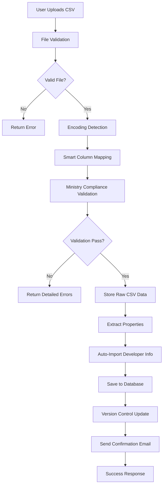

# CSV Import Flow Documentation

> Comprehensive guide to OTO-RAPORT's CSV-first data strategy for Polish real estate compliance

## Table of Contents

1. [Overview](#overview)
2. [CSV Format Requirements](#csv-format-requirements)
3. [Import Process](#import-process)
4. [Data Priority System](#data-priority-system)
5. [Field Mapping Reference](#field-mapping-reference)
6. [Validation Rules](#validation-rules)
7. [Edge Cases](#edge-cases)
8. [User Guide](#user-guide)
9. [Technical Reference](#technical-reference)
10. [Troubleshooting](#troubleshooting)
11. [FAQ](#faq)

---

## Overview

OTO-RAPORT implements a **CSV-first data strategy** designed specifically for compliance with Polish ministry requirements (ustawa z dnia 21 maja 2025 r. o jawności cen mieszkań). This approach ensures that:

- **Raw CSV data is the single source of truth** for ministerial reporting
- **Never overwritten** by user edits or system placeholders
- **Version-controlled** with complete upload history
- **Fully auditable** with immutable logs

### Key Features

- ✅ Ministry Schema 1.13 compliant (58-59 columns)
- ✅ Smart encoding detection (UTF-8, Windows-1250, ISO-8859-2)
- ✅ Polish character support (ą, ć, ę, ł, ń, ó, ś, ź, ż)
- ✅ Intelligent column mapping with fuzzy matching
- ✅ Comprehensive validation with detailed error reporting
- ✅ Version control for upload history
- ✅ **Automatic developer profile update from CSV** (always overwrites)
- ✅ User notification for profile changes
- ✅ Excel (.xlsx, .xls) and CSV support

---

## CSV Format Requirements

### Ministry Schema 1.13

The Polish Ministry requires a specific CSV format with 58-59 columns based on the official template.

#### File Format Specifications

| Specification | Requirement |
|--------------|-------------|
| **Separator** | Semicolon (`;`) |
| **Encoding** | UTF-8 or Windows-1250 (auto-detected) |
| **Header Row** | Required (first row) |
| **Column Count** | 58-59 columns (ministry standard) |
| **File Size Limit** | 10 MB maximum |
| **Supported Formats** | `.csv`, `.xlsx`, `.xls` |

#### Column Structure

The CSV must contain these ministerial columns (Polish names):

```
Województwo lokalizacji przedsięwzięcia deweloperskiego
Powiat lokalizacji przedsięwzięcia deweloperskiego
Gmina lokalizacji przedsięwzięcia deweloperskiego
Miejscowość lokalizacji przedsięwzięcia deweloperskiego
Kod pocztowy lokalizacji przedsięwzięcia deweloperskiego
Nr lokalu lub domu jednorodzinnego nadany przez dewelopera
Cena m 2 powierzchni użytkowej lokalu mieszkalnego / domu jednorodzinnego [zł]
Cena lokalu mieszkalnego lub domu jednorodzinnego [zł]
... (and 50+ more columns)
```

> **Note**: The system accepts custom column names and uses intelligent fuzzy matching to map them to ministry fields. See [Field Mapping Reference](#field-mapping-reference) for details.

#### Polish Character Encoding

The parser automatically detects and handles:

- **UTF-8** with BOM (highest priority)
- **UTF-8** without BOM
- **Windows-1250** (common in Excel exports)
- **ISO-8859-2** (Central European)

Polish characters are preserved: `ą ć ę ł ń ó ś ź ż Ą Ć Ę Ł Ń Ó Ś Ź Ż`

---

## Import Process

### Step-by-Step Flow



### Data Storage Architecture

The system uses a dual-storage approach:

#### 1. **Raw CSV Data Table** (`raw_csv_data`)

Stores the original uploaded data exactly as received:

```sql
CREATE TABLE raw_csv_data (
  id UUID PRIMARY KEY,
  property_id UUID,           -- Links to properties table
  project_id UUID,            -- Links to projects table
  developer_id UUID,          -- Links to developers table
  raw_data JSONB NOT NULL,    -- All 58+ ministerial columns (PRESERVED AS-IS)
  file_name TEXT,             -- Original file name
  row_number INTEGER,         -- Original row in CSV (for debugging)
  uploaded_at TIMESTAMP,      -- When uploaded
  version INTEGER DEFAULT 1,  -- Version number (increments on re-upload)
  is_latest BOOLEAN DEFAULT true -- Quick access to latest version
);
```

**Key Characteristics:**
- **Immutable** - Never overwritten or modified
- **Complete** - All 58+ ministry columns stored as uploaded
- **JSONB format** - Fast queries with GIN indexing
- **Version tracked** - Full upload history

#### 2. **Properties Table** (`properties`)

Stores normalized, editable property data:

```sql
CREATE TABLE properties (
  id UUID PRIMARY KEY,
  project_id UUID,
  developer_id UUID,

  -- Location (required)
  wojewodztwo TEXT,
  powiat TEXT,
  gmina TEXT,
  miejscowosc TEXT,
  ulica TEXT,
  kod_pocztowy TEXT,

  -- Property details (required)
  property_type TEXT,
  apartment_number TEXT,
  area DECIMAL,

  -- Prices (required)
  price_per_m2 DECIMAL,
  base_price DECIMAL,
  final_price DECIMAL,

  -- Additional fields (optional)
  rooms INTEGER,
  floor INTEGER,
  status TEXT,
  ... (40+ more fields)
);
```

**Key Characteristics:**
- **Editable** - Users can manually update via dashboard
- **Normalized** - Structured for efficient querying
- **Supplements raw data** - Fills gaps but never overwrites CSV source

### Version Control

Every CSV upload creates a new version:

```typescript
// Example version history for a project
[
  { version: 1, uploaded_at: '2025-01-10T08:00:00Z', is_latest: false },
  { version: 2, uploaded_at: '2025-01-15T10:30:00Z', is_latest: false },
  { version: 3, uploaded_at: '2025-01-20T14:00:00Z', is_latest: true }
]
```

**Re-upload Behavior:**
1. System detects existing project/properties
2. Increments version number
3. Marks previous versions as `is_latest = false`
4. Stores new version with `is_latest = true`
5. **Preserves all historical versions** for audit trail

---

### Developer Profile Auto-Import

**NEW (Task #84.1):** Every CSV upload automatically updates your developer profile with data found in the CSV.

#### How It Works

When you upload a CSV file, the system:

1. **Extracts developer information** from the first row (or header metadata)
2. **Automatically updates your profile** with any new data found
3. **Overwrites existing fields** with CSV data (latest CSV always wins)
4. **Preserves existing data** when CSV field is empty
5. **Notifies you** about the number of fields updated

#### Auto-Import Rules

```typescript
// RULE 1: CSV data ALWAYS overwrites profile fields
if (csvField.hasValue() && profileField.hasValue()) {
  profileField = csvField  // ✅ CSV wins (overwrite)
}

// RULE 2: CSV fills empty profile fields
if (csvField.hasValue() && !profileField.hasValue()) {
  profileField = csvField  // ✅ Fill empty field
}

// RULE 3: Empty CSV fields are skipped (preserve existing data)
if (!csvField.hasValue() && profileField.hasValue()) {
  // ❌ Do nothing - keep existing profile data
}
```

#### Example Scenario

```typescript
// Initial profile state
profile.company_name = "Old Company Name"
profile.nip = "1234567890"
profile.email = "old@example.com"
profile.phone = ""  // Empty

// CSV upload contains:
csv.company_name = "New Company Name"  // Different value
csv.nip = "9876543210"                 // Different NIP
csv.email = ""                         // Empty in CSV
csv.phone = "123456789"                // New value

// After auto-import:
profile.company_name = "New Company Name"  // ✅ Overwritten from CSV
profile.nip = "9876543210"                 // ✅ Overwritten from CSV
profile.email = "old@example.com"          // ✅ Preserved (CSV was empty)
profile.phone = "123456789"                // ✅ Filled from CSV

// User sees notification:
"Profil dewelopera zaktualizowany z CSV (3 pól)."
```

#### Supported Developer Fields

The auto-import recognizes these developer-related CSV columns:

**Company Information:**
- `nazwa_dewelopera` → `company_name`
- `forma_prawna` → `legal_form`
- `nip` → `nip`
- `regon` → `regon`
- `nr_krs` → `krs_number`
- `nr_ceidg` → `ceidg_number`

**Contact Information:**
- `telefon` → `phone`
- `email` → `email`
- `nr_faxu` → `fax`
- `adres_strony_www` → `website`

**Address (Headquarters):**
- `wojewodztwo_siedziby` → `headquarters_voivodeship`
- `powiat_siedziby` → `headquarters_county`
- `gmina_siedziby` → `headquarters_municipality`
- `miejscowosc_siedziby` → `headquarters_city`
- `ulica_siedziby` → `headquarters_street`
- `nr_budynku_siedziby` → `headquarters_building_number`
- `nr_lokalu_siedziby` → `headquarters_apartment_number`
- `kod_pocztowy_siedziby` → `headquarters_postal_code`

**Additional Information:**
- `dodatkowe_lokalizacje_sprzedazy` → `additional_sales_locations`
- `sposob_kontaktu` → `contact_method`

#### User Notification

After a successful upload with auto-import, you'll see:

```
✅ Plik został pomyślnie przesłany i przetworzony.
   Dane zapisane w bazie.
   Profil dewelopera zaktualizowany z CSV (15 pól).
```

The notification shows:
- Number of fields updated from CSV
- Only appears when `autoImportedFields > 0`
- Helps you track what data was automatically imported

#### Best Practices

**✅ DO:**
- Include complete developer data in every CSV upload
- Use consistent company name across all CSVs
- Verify auto-imported data in Settings after first upload
- Keep your CSV as single source of truth for company info

**❌ DON'T:**
- Manually edit developer profile if using CSV uploads (will be overwritten)
- Mix different company names in CSVs (latest CSV wins)
- Leave developer fields empty in CSV if you want to preserve existing data

#### Disabling Auto-Import

Auto-import **cannot be disabled** - it's a core feature for fast onboarding. However:
- Empty CSV fields won't overwrite existing profile data
- You can review changes in Settings → Developer Profile after upload
- Historical profile state is not tracked (only current state matters)

---

## Data Priority System

OTO-RAPORT uses a strict **3-tier hierarchy** to ensure data integrity:

### Priority Hierarchy

```
┌─────────────────────────────────────────────┐
│ 1️⃣ Raw CSV Data (PRIMARY SOURCE)          │
│    - Never overwritten                      │
│    - Always used for ministry XML export    │
│    - Stored in raw_csv_data table          │
└─────────────────────────────────────────────┘
              ⬇️  (fills gaps only)
┌─────────────────────────────────────────────┐
│ 2️⃣ Manual Fills (SECONDARY)               │
│    - User edits via dashboard               │
│    - Only for fields missing in CSV         │
│    - Stored in properties table             │
└─────────────────────────────────────────────┘
              ⬇️  (fills gaps only)
┌─────────────────────────────────────────────┐
│ 3️⃣ Developer Defaults (TERTIARY)          │
│    - Auto-filled from developer profile     │
│    - Only for empty fields                  │
│    - Lowest priority                        │
└─────────────────────────────────────────────┘
```

### Example Scenario

```typescript
// Developer profile
developer.nip = "1234567890"

// CSV upload (version 1)
csv_row.nip = "9876543210"  // Different NIP in CSV

// User manual edit
properties.nip = "5555555555"  // User changes NIP in dashboard

// Ministry XML export uses:
xml.nip = "9876543210"  // ✅ CSV data ALWAYS wins
```

**Why this matters:**
- Ministry reports always reflect the exact CSV data
- Users can supplement missing fields without corrupting source data
- Audit trail maintains complete data lineage

---

## Field Mapping Reference

The system uses **intelligent fuzzy matching** to map various column names to ministry fields.

### Required Fields (8)

These fields MUST be present in your CSV. Missing any of these will **block upload**.

| Ministry Field | Database Field | Type | Validation | Example |
|---------------|----------------|------|------------|---------|
| Województwo lokalizacji | `wojewodztwo` | text | Must be valid Polish voivodeship | `mazowieckie` |
| Powiat lokalizacji | `powiat` | text | Min 2 chars, max 100 | `warszawski` |
| Gmina lokalizacji | `gmina` | text | Min 2 chars, max 100 | `Warszawa` |
| Miejscowość lokalizacji | `miejscowosc` | text | Min 2 chars, max 100 | `Warszawa` |
| Kod pocztowy | `kod_pocztowy` | text | Format: `XX-XXX` | `00-001` |
| Cena m² powierzchni użytkowej | `price_per_m2` | decimal | Must be > 0 | `12500.00` |
| Cena finalna lokalu | `final_price` | decimal | Must be > 0 | `500000.00` |
| Powierzchnia użytkowa | `area` | decimal | Must be > 0 | `40.00` |

### Recommended Fields (15)

These fields are **highly recommended** by the ministry. Missing these generates **warnings** but allows upload.

| Ministry Field | Database Field | Type | Description |
|---------------|----------------|------|-------------|
| Ulica lokalizacji | `ulica` | text | Street name |
| Numer nieruchomości | `numer_nieruchomosci` | text | Building/plot number |
| Data pierwszej oferty | `data_pierwszej_oferty` | date | First listing date (YYYY-MM-DD) |
| Data obowiązywania ceny | `price_valid_from` | date | Price valid from date |
| Cena początkowa za m² | `cena_za_m2_poczatkowa` | decimal | Initial price per m² |
| Cena finalna początkowa | `cena_finalna_poczatkowa` | decimal | Initial final price |
| Liczba pokoi | `liczba_pokoi` | integer | Number of rooms (1-20) |
| Kondygnacja | `kondygnacja` | integer | Floor number (-2 to 100) |
| Liczba kondygnacji | `liczba_kondygnacji` | integer | Number of floors (1-100) |
| Powierzchnia całkowita | `powierzchnia_calkowita` | decimal | Total area (m²) |
| Status sprzedaży | `status_sprzedazy` | text | `dostępne`, `zarezerwowane`, `sprzedane` |
| Forma własności | `forma_wlasnosci` | text | `pełna własność`, `spółdzielcze`, etc. |
| Układ mieszkania | `uklad_mieszkania` | text | `rozkładowe`, `nierozkładowe` |
| Stan wykończenia | `stan_wykonczenia` | text | `deweloperski`, `pod klucz`, etc. |
| Rok budowy | `rok_budowy` | integer | Year built (1800-2100) |

### Full Ministry Column Mapping

The parser recognizes **multiple variations** of each field name. Here are some examples:

#### Property Number (Nr lokalu)

```typescript
// Official ministry names (highest priority)
'nr lokalu lub domu jednorodzinnego nadany przez dewelopera'
'oznaczenie lokalu nadane przez dewelopera'

// Generic names
'nr lokalu', 'numer lokalu', 'nr mieszkania', 'numer mieszkania'
'lokal', 'mieszkanie', 'apartment_number'

// Fallback (lowest priority)
'nr'  // Too generic - only used as last resort
```

#### Price per m² (Cena za m²)

```typescript
// Official ministry names
'cena m 2 powierzchni użytkowej lokalu mieszkalnego / domu jednorodzinnego [zł]'
'cena metra kwadratowego powierzchni użytkowej'

// Generic names (with and without space)
'cena za m²', 'cena za m2', 'cena m2', 'cena m²'
'cena za m 2', 'cena m 2'  // Variants with space
'price_per_m2', 'price_per_sqm'
```

#### Location Fields

```typescript
wojewodztwo: [
  'województwo lokalizacji przedsięwzięcia deweloperskiego',
  'województwo', 'wojewodztwo', 'voivodeship', 'region', 'woj'
]

powiat: [
  'powiat lokalizacji przedsięwzięcia deweloperskiego',
  'powiat', 'county', 'district', 'pow'
]

gmina: [
  'gmina lokalizacji przedsięwzięcia deweloperskiego',
  'gmina', 'municipality', 'commune', 'gm'
]
```

> **Tip**: The system performs **case-insensitive fuzzy matching** with:
> - Diacritic normalization (ą → a, ę → e, etc.)
> - Whitespace normalization
> - Special character removal
> - Similarity scoring (>=80% threshold)

---

## Validation Rules

### Overview

The system performs **three levels of validation**:

1. **File-level validation** - Format, size, structure
2. **Field-level validation** - Data types, formats, ranges
3. **Row-level validation** - Individual property checks

### File-Level Validation

```typescript
interface FileValidation {
  maxSize: 10 * 1024 * 1024,  // 10 MB
  allowedExtensions: ['csv', 'xlsx', 'xls'],
  allowedMimeTypes: [
    'text/csv',
    'application/vnd.ms-excel',
    'application/vnd.openxmlformats-officedocument.spreadsheetml.sheet'
  ]
}
```

**Blocking Errors:**
- File size exceeds 10 MB
- Invalid file extension
- Malicious file content detected
- File name contains path traversal characters

### Field-Level Validation

#### Required Field Validation

```typescript
// Example: Wojewodztwo validation
if (!property.wojewodztwo || property.wojewodztwo.trim() === '') {
  errors.push('Missing required field: Województwo')
}

// Must be valid Polish voivodeship
const validVoivodeships = [
  'dolnośląskie', 'kujawsko-pomorskie', 'lubelskie', 'lubuskie',
  'łódzkie', 'małopolskie', 'mazowieckie', 'opolskie',
  'podkarpackie', 'podlaskie', 'pomorskie', 'śląskie',
  'świętokrzyskie', 'warmińsko-mazurskie', 'wielkopolskie', 'zachodniopomorskie'
]

if (!validVoivodeships.includes(property.wojewodztwo.toLowerCase())) {
  errors.push('Invalid województwo value')
}
```

#### Format Validation

**Postal Code (XX-XXX):**
```typescript
const postalCodeRegex = /^[0-9]{2}-[0-9]{3}$/
if (!postalCodeRegex.test(property.kod_pocztowy)) {
  errors.push('Invalid postal code format. Expected: XX-XXX (e.g., 00-001)')
}
```

**Date (YYYY-MM-DD):**
```typescript
const dateRegex = /^\d{4}-\d{2}-\d{2}$/
if (property.data_pierwszej_oferty && !dateRegex.test(property.data_pierwszej_oferty)) {
  errors.push('Invalid date format. Expected: YYYY-MM-DD')
}

// Additional validation: date must be in past or present
const date = new Date(property.data_pierwszej_oferty)
if (date > new Date()) {
  warnings.push('Date is in the future - please verify')
}
```

**Numeric Fields:**
```typescript
// Prices must be positive
if (property.price_per_m2 <= 0) {
  errors.push('Price per m² must be greater than 0')
}

// Area must be reasonable (1-10000 m²)
if (property.area < 1 || property.area > 10000) {
  warnings.push('Unusual area value - please verify')
}

// Rooms must be in valid range
if (property.rooms && (property.rooms < 1 || property.rooms > 20)) {
  warnings.push('Unusual number of rooms - please verify')
}
```

### Row-Level Validation

Each property (row) is validated individually:

```typescript
interface RowError {
  rowNumber: number          // Original row in CSV
  propertyNumber: string     // Property identifier
  errors: string[]           // Blocking errors
  warnings: string[]         // Non-blocking warnings
}

// Example output
{
  rowNumber: 15,
  propertyNumber: "A1-23",
  errors: [
    "Missing required field: Województwo",
    "Invalid postal code format"
  ],
  warnings: [
    "Missing recommended field: Ulica"
  ]
}
```

### Validation Result Structure

```typescript
interface ValidationResult {
  valid: boolean                    // Overall pass/fail
  complianceScore: number          // 0-100% (based on required + recommended fields)
  errors: string[]                 // Global errors (entire file)
  warnings: string[]               // Global warnings
  missingCriticalFields: string[]  // List of missing required fields
  fieldValidation: {
    requiredPresent: number        // Count of present required fields
    requiredMissing: number        // Count of missing required fields
    recommendedPresent: number     // Count of present recommended fields
    recommendedMissing: number     // Count of missing recommended fields
  }
  rowErrors: RowError[]            // Per-row validation results
}
```

### Error Types and Handling

| Error Type | Severity | Action | Example |
|------------|----------|--------|---------|
| **Blocking** | Critical | Upload rejected | Missing required field |
| **Warning** | Medium | Upload allowed | Missing recommended field |
| **Info** | Low | Upload allowed | Unusual value detected |

**Blocking Errors:**
- Missing required fields (8 fields)
- Invalid data formats (postal code, dates)
- Invalid enum values (województwo, status)
- Data type mismatches (text in numeric field)

**Warnings (Non-Blocking):**
- Missing recommended fields (15 fields)
- Unusual values (area > 1000 m², rooms > 10)
- Future dates
- Empty optional fields

---

## Edge Cases

### 1. Partial CSV Files

**Scenario:** CSV has some properties with missing required fields.

**Behavior:**
```typescript
// Example: 100 rows uploaded, 5 have missing województwo
{
  valid: false,
  errors: ["5 properties missing required field: Województwo"],
  rowErrors: [
    { rowNumber: 12, errors: ["Missing required field: Województwo"] },
    { rowNumber: 23, errors: ["Missing required field: Województwo"] },
    // ... 3 more
  ]
}
```

**Result:** ❌ **Upload blocked** - User must fix the 5 properties and re-upload.

**User Action Required:**
1. Download validation report showing which rows failed
2. Fix missing data in CSV
3. Re-upload corrected file

---

### 2. Re-uploads and Versioning

**Scenario:** User uploads CSV, then uploads updated CSV for same project.

**Behavior:**
```typescript
// First upload (version 1)
POST /api/upload
→ version: 1, is_latest: true

// Second upload (version 2) - automatic versioning
POST /api/upload
→ marks version 1 as is_latest: false
→ creates version 2 with is_latest: true

// Database state after re-upload:
[
  { version: 1, is_latest: false, uploaded_at: '2025-01-10T08:00:00Z' },
  { version: 2, is_latest: true,  uploaded_at: '2025-01-15T10:30:00Z' }
]
```

**Result:** ✅ **Both versions preserved** for audit trail. Latest version used for exports.

**Key Points:**
- Old properties are **deleted** before inserting new ones (to avoid duplicates)
- Raw CSV data for old version is **preserved** in `raw_csv_data` table
- Version history is **queryable** for compliance audits

---

### 3. Conflicting Data

**Scenario:** CSV has different values than user's manual edits.

**Example:**
```typescript
// CSV upload (version 1)
csv.price_per_m2 = 12000

// User manual edit
properties.price_per_m2 = 13500

// User uploads new CSV (version 2)
csv.price_per_m2 = 12500

// Ministry XML export uses:
xml.price_per_m2 = 12500  // ✅ Latest CSV always wins
```

**Result:** ✅ **CSV data takes priority** - Ministry reports always use raw CSV, not user edits.

**Conflict Resolution:**
1. Ministry XML/CSV exports: Use `raw_csv_data` (version 2)
2. Dashboard display: Show `properties` table (manual edits)
3. Data merging: CSV fields override manual fills

**User Warning:**
> "Uwaga: Przesłanie nowego CSV nadpisze wartości wprowadzone ręcznie. Dane ministerstwa będą pobierane z najnowszego CSV."

---

### 4. Encoding Issues

**Scenario:** CSV exported from Excel with Windows-1250 encoding.

**Behavior:**
```typescript
// Automatic detection
const encodingResult = detectEncodingAndDecode(arrayBuffer)

// Detection algorithm:
1. Check for UTF-8 BOM (0xEF 0xBB 0xBF)
2. Try UTF-8 decode (strict mode)
3. Analyze byte frequency for Polish chars
4. Try Windows-1250 if Polish chars detected
5. Try ISO-8859-2 as fallback
6. Final fallback: UTF-8 with replacement chars

// Example detection:
{
  encoding: 'windows-1250',
  confidence: 'high',
  hasPolishChars: true
}
```

**Result:** ✅ **Automatic handling** - Polish characters preserved correctly.

**Console Logs:**
```
📝 ENCODING: Windows-1250 detected (confidence: high) 🇵🇱
```

**Supported Encodings:**
- UTF-8 with BOM (highest priority)
- UTF-8 without BOM
- Windows-1250 (common in Polish Excel)
- ISO-8859-2 (Central European)

---

### 5. Malformed Rows

**Scenario:** CSV has rows with incorrect column count or invalid data.

**Behavior:**
```typescript
// Example: Row has 55 columns instead of 58
{
  valid: false,
  errors: ["Row 15: Expected 58 columns, found 55"],
  rowErrors: [
    {
      rowNumber: 15,
      propertyNumber: 'unknown',
      errors: ["Column count mismatch"]
    }
  ]
}
```

**Result:** ✅ **Other rows still imported** if they are valid. Malformed rows reported in validation.

**Parser Behavior:**
- **Skips empty rows** (blankrows: false)
- **Continues parsing** after encountering malformed row
- **Reports all errors** at end of parsing
- **Valid rows saved** to database
- **Invalid rows listed** in error report

---

### 6. Missing Columns

**Scenario:** CSV is missing some ministry columns entirely.

**Behavior:**
```typescript
// Example: CSV missing "Ulica" column
{
  valid: true,  // Still valid if not required field
  warnings: [
    "Missing recommended field: Ulica (affects 100 properties)"
  ],
  missingCriticalFields: [],
  fieldValidation: {
    requiredPresent: 8,
    requiredMissing: 0,
    recommendedPresent: 14,
    recommendedMissing: 1  // Ulica missing
  },
  complianceScore: 95.7  // (8 + 14) / (8 + 15) * 100
}
```

**Result:** ⚠️ **Upload allowed with warning** if missing field is not required.

**Missing Required Field:**
```typescript
// Example: CSV missing "Województwo" column
{
  valid: false,
  errors: [
    "Missing required field: Województwo (affects all properties)"
  ],
  missingCriticalFields: ["Województwo"]
}
```

**Result:** ❌ **Upload blocked** if missing field is required.

---

### 7. Large Files

**Scenario:** User uploads a CSV with 10,000 properties.

**Behavior:**
```typescript
// Streaming parser handles large files efficiently
const parser = new SmartCSVParser(csvContent)
const result = parser.analyzeColumns()

// Memory-efficient processing:
- Uses streaming CSV parsing (not loading entire file into memory)
- Batch inserts to database (1000 properties at a time)
- Progress tracking via console logs
```

**Performance:**
- **10 MB limit** enforced at API level
- **Streaming parsing** - no memory spikes
- **Batch database inserts** - faster than row-by-row
- **Timeout**: 2-minute API timeout for large uploads

**Console Logs:**
```
📊 UPLOAD API: Parsed 10000 properties
🔧 DATABASE: Inserting 10000 properties (batch 1/10)
✅ DATABASE: Saved 10000 properties in 45 seconds
```

---

## User Guide

### Preparing Your CSV

#### Step 1: Use the Ministry Template

Download the official ministry CSV template from:
- [dane.gov.pl/pl/dataset/2849](https://dane.gov.pl/pl/dataset/2849) (official template)
- Or use OTO-RAPORT's pre-filled template (available in dashboard)

#### Step 2: Include Developer Information (Recommended)

**NEW:** OTO-RAPORT automatically updates your developer profile from CSV data. Include these fields for **instant onboarding (<1 minute)**:

**Required Developer Fields:**
```csv
nazwa_dewelopera;      # Company name (e.g., "ACME Development Sp. z o.o.")
nip;                   # Tax ID (10 digits, e.g., "1234567890")
email;                 # Contact email
telefon;               # Phone number
```

**Recommended Developer Fields:**
```csv
forma_prawna;          # Legal form (e.g., "Spółka z ograniczoną odpowiedzialnością")
regon;                 # REGON number (9 or 14 digits)
nr_krs;                # KRS number (10 digits, only for Sp. z o.o., S.A., etc.)
nr_ceidg;              # CEIDG number (if applicable)
adres_strony_www;      # Website URL

# Headquarters address
wojewodztwo_siedziby;
powiat_siedziby;
gmina_siedziby;
miejscowosc_siedziby;
ulica_siedziby;
nr_budynku_siedziby;
kod_pocztowy_siedziby;
```

**Example CSV Header (first row):**
```csv
nazwa_dewelopera;forma_prawna;nip;regon;email;telefon;wojewodztwo_siedziby;...
ACME Development Sp. z o.o.;Spółka z ograniczoną odpowiedzialnością;1234567890;123456789;contact@acme.pl;+48123456789;mazowieckie;...
```

**Important Notes:**
- Developer fields should be **the same in every row** (system uses first row)
- Latest CSV upload **always overwrites** your profile (Task #84.1)
- Empty CSV fields preserve existing profile data
- You'll see notification: "Profil dewelopera zaktualizowany z CSV (X pól)."

#### Step 3: Fill Required Property Fields

Ensure these 8 fields are present in **every row**:

```
✅ Województwo (e.g., "mazowieckie")
✅ Powiat (e.g., "warszawski")
✅ Gmina (e.g., "Warszawa")
✅ Miejscowość (e.g., "Warszawa")
✅ Kod pocztowy (e.g., "00-001")
✅ Cena za m² (e.g., "12500.00")
✅ Cena finalna (e.g., "500000.00")
✅ Powierzchnia użytkowa (e.g., "40.00")
```

#### Step 3: Format Data Correctly

**Dates** - Use ISO format:
```
✅ CORRECT: 2025-01-15
❌ INCORRECT: 15/01/2025, 15.01.2025, Jan 15 2025
```

**Postal Codes** - Use XX-XXX format:
```
✅ CORRECT: 00-001, 12-345
❌ INCORRECT: 00001, 12 345, 123-45
```

**Numbers** - Use decimal notation:
```
✅ CORRECT: 12500.00, 40.5
❌ INCORRECT: 12 500,00, 12,500.00 (commas as thousands separators)
```

**Status** - Use Polish values:
```
✅ CORRECT: dostępne, zarezerwowane, sprzedane
❌ INCORRECT: available, reserved, sold
```

#### Step 4: Save with Correct Encoding

**Recommended: UTF-8 with BOM**

- Excel: Save as "CSV UTF-8 (Comma delimited) (*.csv)"
- Google Sheets: File → Download → Comma-separated values (.csv)
- LibreOffice: Save as CSV, select "Unicode (UTF-8)" encoding

**Alternative: Windows-1250**

If using older Excel versions, Windows-1250 is acceptable. The system will auto-detect it.

---

### Uploading to Dashboard

#### Step 1: Navigate to Dashboard

Go to: `https://oto-raport.pl/dashboard`

#### Step 2: Select Project (Optional)

- If uploading to existing project: Select it from dropdown
- If creating new project: Leave blank (auto-creates from filename)

#### Step 3: Upload File

1. Click "Upload CSV/Excel" button
2. Select your prepared file
3. Wait for validation (usually <5 seconds)

#### Step 4: Review Validation Results

**Success Response:**
```json
{
  "success": true,
  "message": "Plik został pomyślnie przesłany i przetworzony. Dane zapisane w bazie. Profil dewelopera zaktualizowany z CSV (15 pól).",
  "data": {
    "fileName": "osiedle_example.csv",
    "recordsCount": 100,
    "validRecords": 100,
    "autoImportedFields": 15,
    "savedToDatabase": true
  }
}
```

**Success Message Breakdown:**
- `"Plik został pomyślnie przesłany i przetworzony."` - Base success message
- `"Dane zapisane w bazie."` - Confirms properties saved to database
- `"Profil dewelopera zaktualizowany z CSV (15 pól)."` - **NEW:** Shows auto-import results (only if `autoImportedFields > 0`)

**Error Response:**
```json
{
  "error": "Walidacja CSV nie powiodła się",
  "validation": {
    "valid": false,
    "complianceScore": 65.2,
    "summary": {
      "totalErrors": 5,
      "totalWarnings": 12,
      "propertiesWithErrors": 5
    },
    "globalErrors": [
      "Missing required field: Województwo (affects 5 properties)"
    ],
    "rowErrors": [
      {
        "rowNumber": 15,
        "propertyNumber": "A1-23",
        "errors": ["Missing required field: Województwo"]
      }
    ]
  }
}
```

---

### Understanding Validation Results

#### Compliance Score

The **compliance score** indicates how complete your data is:

```
Score = (Present Required + Present Recommended) / (Total Required + Total Recommended) × 100

Example:
- Required present: 8/8 (100%)
- Recommended present: 12/15 (80%)
- Compliance Score: (8+12)/(8+15) = 20/23 = 87%
```

**Interpretation:**
- **100%** - Perfect! All required and recommended fields present
- **90-99%** - Excellent - Missing some recommended fields
- **80-89%** - Good - Missing several recommended fields
- **70-79%** - Acceptable - Consider adding more data
- **<70%** - Needs improvement - Add recommended fields

#### Error vs Warning

| Type | Meaning | Action Required |
|------|---------|----------------|
| **Error** | Blocks upload | Must fix before re-uploading |
| **Warning** | Allows upload | Optional - improves compliance score |

**Example:**

```
❌ Error: Missing required field "Województwo" → MUST FIX
⚠️ Warning: Missing recommended field "Ulica" → OPTIONAL
```

---

### Using Manual Fill UI

For fields missing in your CSV, use the **Manual Fill UI** in Settings:

#### Step 1: Navigate to Settings

Dashboard → Settings → "Manual Data Completion"

#### Step 2: Select Project

Choose the project with missing data.

#### Step 3: Fill Missing Fields

The UI shows:
- **Red badges** - Missing required fields (critical)
- **Yellow badges** - Missing recommended fields (important)
- **Gray badges** - Optional fields

#### Step 4: Save Changes

Click "Save" - changes apply to `properties` table only (CSV data untouched).

**Important Notes:**
- Manual fills **do not affect** ministry XML exports (CSV data used)
- Manual fills **only supplement** gaps - never overwrite CSV values
- Manual fills are **per-property** - update each property individually

---

### Downloading Validation Reports

After upload (success or failure), download a detailed report:

#### Report Contents

```json
{
  "uploadDate": "2025-01-15T10:30:00Z",
  "fileName": "osiedle_example.csv",
  "totalRows": 100,
  "validRows": 95,
  "invalidRows": 5,
  "complianceScore": 87.0,
  "globalErrors": [...],
  "globalWarnings": [...],
  "rowErrors": [
    {
      "rowNumber": 15,
      "propertyNumber": "A1-23",
      "errors": ["Missing required field: Województwo"],
      "warnings": ["Missing recommended field: Ulica"]
    }
  ]
}
```

#### How to Download

1. After upload, click "Download Validation Report"
2. Opens JSON file with full validation details
3. Use for offline analysis or sharing with team

#### Using Report to Fix CSV

```bash
# Example: Fix rows with errors
cat validation_report.json | jq '.rowErrors[] | .rowNumber'
→ 15, 23, 34, 45, 67

# Open CSV, navigate to rows 15, 23, etc.
# Fix missing data
# Re-upload
```

---

### Understanding Compliance Score

Your **compliance score** directly impacts:

1. **Ministry report quality** - Higher score = more complete data
2. **Legal compliance** - Ministry requires high data completeness
3. **Audit readiness** - Complete data passes audits easily

**Target Scores:**
- **95%+** - Ideal for ministry reporting
- **85-94%** - Acceptable but room for improvement
- **<85%** - Add more data to improve compliance

---

## Technical Reference

### API Endpoints

#### 1. Upload CSV/Excel

```
POST /api/upload
```

**Request:**
```typescript
Content-Type: multipart/form-data

FormData:
  - file: File (CSV or Excel)
  - project_id: string (optional - if null, auto-creates project)
```

**Response (Success):**
```typescript
{
  success: true,
  message: string,  // Dynamic message with profile update notification
  data: {
    fileName: string,           // Original file name
    recordsCount: number,       // Total properties in CSV
    validRecords: number,       // Properties that passed validation
    autoImportedFields: number, // NEW: Number of developer profile fields updated from CSV
    savedToDatabase: boolean,   // Whether data was saved successfully
    preview: ParsedProperty[],  // First 3 properties for preview
    trackingData: {
      fileType: 'csv' | 'xlsx' | 'xls',
      recordsCount: number
    }
  }
}
```

**Message Format (Task #84.3):**
```typescript
// Base message
message = "Plik został pomyślnie przesłany i przetworzony."

// Append database save confirmation
if (savedToDatabase) {
  message += " Dane zapisane w bazie."
}

// Append profile update notification (NEW)
if (autoImportedFields > 0) {
  message += ` Profil dewelopera zaktualizowany z CSV (${autoImportedFields} pól).`
}

// Example full messages:
"Plik został pomyślnie przesłany i przetworzony. Dane zapisane w bazie. Profil dewelopera zaktualizowany z CSV (15 pól)."
"Plik został pomyślnie przesłany i przetworzony. Dane zapisane w bazie."
```

**Field Details:**

| Field | Type | Description |
|-------|------|-------------|
| `autoImportedFields` | number | **NEW (Task #84.1):** Number of developer profile fields automatically updated from CSV. `0` if no fields were updated or auto-import failed. Use this to show user feedback about profile changes. |
| `message` | string | **UPDATED (Task #84.3):** Dynamic success message that includes profile update notification when `autoImportedFields > 0`. Shows user exactly what happened during upload. |

**Response (Validation Failure):**
```typescript
{
  error: "Walidacja CSV nie powiodła się",
  message: "Plik zawiera błędy krytyczne...",
  validation: ValidationResult
}
```

**Rate Limits:**
- **Unauthenticated**: 10 uploads/hour (IP-based)
- **Authenticated**: 50 uploads/hour (user-based)

---

#### 2. Export Ministry CSV

```
GET /api/public/[clientId]/data.csv
```

**Response:**
```
Content-Type: text/csv; charset=utf-8
Content-Disposition: attachment; filename="data.csv"

CSV content (ministry schema 1.13)
```

**Data Source:** `raw_csv_data` table (latest version)

**Key Point:** This endpoint uses **raw CSV data**, not user-edited properties.

---

### Database Schema

#### raw_csv_data Table

```sql
CREATE TABLE raw_csv_data (
  -- Primary key
  id UUID PRIMARY KEY DEFAULT gen_random_uuid(),

  -- Foreign keys
  property_id UUID REFERENCES properties(id) ON DELETE CASCADE,
  project_id UUID REFERENCES projects(id) ON DELETE CASCADE,
  developer_id UUID REFERENCES developers(id) ON DELETE CASCADE,

  -- Data storage
  raw_data JSONB NOT NULL,  -- All 58+ ministry columns as uploaded
  file_name TEXT NOT NULL,  -- Original filename
  row_number INTEGER,       -- Original row in CSV (1-based)
  uploaded_at TIMESTAMP WITH TIME ZONE DEFAULT NOW(),

  -- Version control (Task #81.6)
  version INTEGER NOT NULL DEFAULT 1,
  is_latest BOOLEAN NOT NULL DEFAULT true,

  -- Audit
  created_at TIMESTAMP WITH TIME ZONE DEFAULT NOW(),
  updated_at TIMESTAMP WITH TIME ZONE DEFAULT NOW()
);

-- Indexes
CREATE INDEX idx_raw_csv_data_property_id ON raw_csv_data(property_id);
CREATE INDEX idx_raw_csv_data_project_id ON raw_csv_data(project_id);
CREATE INDEX idx_raw_csv_data_developer_id ON raw_csv_data(developer_id);
CREATE INDEX idx_raw_csv_data_uploaded_at ON raw_csv_data(uploaded_at DESC);
CREATE INDEX idx_raw_csv_data_raw_data ON raw_csv_data USING GIN (raw_data);
CREATE INDEX idx_raw_csv_data_project_version ON raw_csv_data(project_id, property_id, version DESC);
CREATE INDEX idx_raw_csv_data_latest ON raw_csv_data(project_id, property_id) WHERE is_latest = true;
```

**Row Level Security:**
```sql
-- Developers can only access their own data
CREATE POLICY "Developers can view their own raw CSV data"
  ON raw_csv_data FOR SELECT
  USING (developer_id IN (
    SELECT id FROM developers WHERE user_id = auth.uid()
  ));
```

---

#### properties Table

```sql
CREATE TABLE properties (
  -- Primary key
  id UUID PRIMARY KEY DEFAULT gen_random_uuid(),

  -- Foreign keys
  project_id UUID REFERENCES projects(id) ON DELETE CASCADE,
  developer_id UUID REFERENCES developers(id) ON DELETE CASCADE,

  -- Location (required)
  wojewodztwo TEXT NOT NULL DEFAULT 'nieznane',
  powiat TEXT NOT NULL DEFAULT 'nieznane',
  gmina TEXT NOT NULL DEFAULT 'nieznane',
  miejscowosc TEXT,
  ulica TEXT,
  nr_budynku TEXT,
  kod_pocztowy TEXT,

  -- Property details (required)
  property_type TEXT NOT NULL DEFAULT 'mieszkanie',
  apartment_number TEXT NOT NULL,
  area DECIMAL(10,2),

  -- Prices (required)
  price_per_m2 DECIMAL(10,2) NOT NULL DEFAULT 1,
  price_valid_from DATE,
  base_price DECIMAL(12,2) NOT NULL DEFAULT 1,
  base_price_valid_from DATE,
  final_price DECIMAL(12,2) NOT NULL DEFAULT 1,
  final_price_valid_from DATE,

  -- Additional fields (optional)
  rooms INTEGER,
  floor INTEGER,
  status TEXT DEFAULT 'available',

  -- Parking
  parking_type TEXT,
  parking_designation TEXT,
  parking_price DECIMAL(10,2),
  parking_date DATE,

  -- Storage
  storage_type TEXT,
  storage_designation TEXT,
  storage_price DECIMAL(10,2),
  storage_date DATE,

  -- Other
  necessary_rights_type TEXT,
  necessary_rights_description TEXT,
  necessary_rights_price DECIMAL(10,2),
  necessary_rights_date DATE,
  other_services_type TEXT,
  other_services_price DECIMAL(10,2),
  prospectus_url TEXT,

  -- Audit
  created_at TIMESTAMP WITH TIME ZONE DEFAULT NOW(),
  updated_at TIMESTAMP WITH TIME ZONE DEFAULT NOW()
);
```

---

### Code Architecture

#### 1. Upload API Handler

**File:** `src/app/api/upload/route.ts`

**Flow:**
```typescript
export async function POST(request: NextRequest) {
  // 1. Rate limiting (tiered: 10/hr unauthenticated, 50/hr authenticated)
  const { response: rateLimitResponse, user } = await rateLimitWithAuth(...)

  // 2. Authentication check
  if (!user) return NextResponse.json({ error: 'Unauthorized' }, { status: 401 })

  // 3. Get/create developer profile
  const developer = await getDeveloperProfile(user.id)

  // 4. Trial status check
  const trialCheck = await canAccessFeature(developer.id, 'upload')
  if (!trialCheck.allowed) return NextResponse.json({ error: 'Trial expired' }, { status: 403 })

  // 5. Parse form data
  const formData = await request.formData()
  const file = formData.get('file') as File

  // 6. File security validation
  const fileValidation = validateUploadFile(file)
  if (!fileValidation.valid) return NextResponse.json({ error: fileValidation.error }, { status: 400 })

  // 7. Encoding detection + parsing
  const arrayBuffer = await file.arrayBuffer()
  const encodingResult = detectEncodingAndDecode(arrayBuffer)
  const parser = new SmartCSVParser(encodingResult.content)
  const smartParseResult = parser.analyzeColumns()

  // 8. Ministry compliance validation
  const validationResult = validateMinistryCompliance(smartParseResult.data)
  if (validationResult.errors.length > 0) {
    return NextResponse.json({ error: 'Validation failed', validation: validationResult }, { status: 400 })
  }

  // 9. Auto-import developer info (optional)
  const autoImportedFields = await autoImportDeveloperInfo(parser, developer.id)

  // 10. Subscription limit check
  const limitCheck = await enforcePropertyLimit(developer.id, smartParseResult.data.length)
  if (!limitCheck.allowed) return NextResponse.json(limitCheck.error, { status: 403 })

  // 11. Save to database
  await savePropertiesToDatabase(developer.id, smartParseResult.data, file.name)

  // 12. Revalidate cache + send email
  revalidatePath('/dashboard')
  await sendUploadConfirmationEmail(developer, { fileName: file.name, ... })

  // 13. Success response
  return NextResponse.json({ success: true, data: { ... } })
}
```

---

#### 2. Smart CSV Parser

**File:** `src/lib/smart-csv-parser.ts`

**Key Functions:**

```typescript
class SmartCSVParser {
  // Parse CSV content and analyze columns
  analyzeColumns(): ParseResult {
    // 1. Parse CSV into rows
    const rows = this.parseCSV()

    // 2. Extract header row
    const headers = rows[0]

    // 3. Intelligent column mapping (fuzzy matching)
    const mappings = this.mapColumns(headers)

    // 4. Extract and normalize property data
    const properties = this.extractProperties(rows, mappings)

    return {
      totalRows: properties.length,
      validRows: properties.filter(p => p.valid).length,
      data: properties,
      mappings,
      detectedFormat: 'ministry',
      formatConfidence: 95.0
    }
  }

  // Map CSV columns to ministry fields
  private mapColumns(headers: string[]): ColumnMappings {
    const mappings = {}

    for (const [field, patterns] of Object.entries(COLUMN_PATTERNS)) {
      for (const header of headers) {
        const similarity = this.calculateSimilarity(header, patterns)
        if (similarity >= 0.8) {
          mappings[field] = header
          break
        }
      }
    }

    return mappings
  }

  // Fuzzy string matching with Polish character support
  private calculateSimilarity(a: string, patterns: string[]): number {
    const normalized_a = this.normalize(a)

    for (const pattern of patterns) {
      const normalized_pattern = this.normalize(pattern)
      const similarity = levenshtein(normalized_a, normalized_pattern)
      if (similarity >= 0.8) return similarity
    }

    return 0
  }

  // Normalize string for comparison
  private normalize(str: string): string {
    return str
      .toLowerCase()
      .normalize('NFD')  // Decompose Polish chars
      .replace(/[\u0300-\u036f]/g, '')  // Remove diacritics
      .replace(/ł/g, 'l')
      .replace(/[^a-z0-9]+/g, '')  // Remove non-alphanumeric
  }
}
```

---

#### 3. Ministry Compliance Validation

**File:** `src/lib/smart-csv-parser.ts`

```typescript
export function validateMinistryCompliance(data: ParsedProperty[]): ValidationResult {
  const errors: string[] = []
  const warnings: string[] = []
  const missingCriticalFields: string[] = []
  const rowErrors: RowError[] = []

  // GLOBAL VALIDATION: Check for missing columns across entire dataset
  const requiredFields = [
    'wojewodztwo', 'powiat', 'gmina', 'miejscowosc', 'kod_pocztowy',
    'price_per_m2', 'final_price', 'area'
  ]

  for (const field of requiredFields) {
    const allMissing = data.every(row => !row[field])
    if (allMissing) {
      missingCriticalFields.push(field)
      errors.push(`Missing required field: ${field} (affects all properties)`)
    }
  }

  // ROW-LEVEL VALIDATION: Check each property individually
  for (let i = 0; i < data.length; i++) {
    const property = data[i]
    const rowNumber = i + 2  // +1 for header, +1 for 1-based indexing
    const propertyErrors: string[] = []
    const propertyWarnings: string[] = []

    // Required field validation
    if (!property.wojewodztwo) {
      propertyErrors.push('Missing required field: Województwo')
    }

    // Format validation
    if (property.kod_pocztowy && !/^[0-9]{2}-[0-9]{3}$/.test(property.kod_pocztowy)) {
      propertyErrors.push('Invalid postal code format (expected: XX-XXX)')
    }

    // Enum validation
    const validVoivodeships = ['dolnośląskie', 'kujawsko-pomorskie', ...]
    if (property.wojewodztwo && !validVoivodeships.includes(property.wojewodztwo.toLowerCase())) {
      propertyErrors.push('Invalid województwo value')
    }

    // Numeric validation
    if (property.price_per_m2 && property.price_per_m2 <= 0) {
      propertyErrors.push('Price per m² must be greater than 0')
    }

    // Store row errors
    if (propertyErrors.length > 0 || propertyWarnings.length > 0) {
      rowErrors.push({
        rowNumber,
        propertyNumber: property.property_number || 'unknown',
        errors: propertyErrors,
        warnings: propertyWarnings
      })
    }
  }

  // Calculate compliance score
  const complianceScore = calculateComplianceScore(data)

  return {
    valid: errors.length === 0 && rowErrors.every(r => r.errors.length === 0),
    complianceScore,
    errors,
    warnings,
    missingCriticalFields,
    fieldValidation: {
      requiredPresent: countPresentFields(data, requiredFields),
      requiredMissing: countMissingFields(data, requiredFields),
      recommendedPresent: countPresentFields(data, recommendedFields),
      recommendedMissing: countMissingFields(data, recommendedFields)
    },
    rowErrors
  }
}
```

---

### Error Codes

| Code | Message | Meaning | Action |
|------|---------|---------|--------|
| `400` | Invalid file format | Unsupported file type | Use CSV, XLSX, or XLS |
| `400` | File too large | Exceeds 10 MB limit | Reduce file size or split |
| `400` | Validation failed | CSV has errors | Fix errors and re-upload |
| `401` | Unauthorized | Not signed in | Sign in first |
| `403` | Trial expired | Trial period ended | Upgrade to paid plan |
| `403` | Property limit exceeded | Too many properties for plan | Upgrade plan or delete old properties |
| `500` | Database error | Internal error | Contact support |

---

## Troubleshooting

### Common Issues

#### Issue: "Missing required field: Województwo"

**Cause:** CSV is missing the `Województwo` column or all rows have empty values.

**Solution:**
1. Check CSV has column named "Województwo" or similar
2. Ensure all rows have valid values (e.g., "mazowieckie")
3. Check for typos in column name

**Valid Województwo values:**
```
dolnośląskie, kujawsko-pomorskie, lubelskie, lubuskie,
łódzkie, małopolskie, mazowieckie, opolskie,
podkarpackie, podlaskie, pomorskie, śląskie,
świętokrzyskie, warmińsko-mazurskie, wielkopolskie, zachodniopomorskie
```

---

#### Issue: "Invalid postal code format"

**Cause:** Postal code not in `XX-XXX` format.

**Solution:**
```
❌ INCORRECT: 00001, 12 345, 123-45
✅ CORRECT: 00-001, 12-345
```

Use find-and-replace in Excel:
1. Find: `(\d{2})(\d{3})`
2. Replace: `$1-$2`

---

#### Issue: "Encoding problems - Polish characters garbled"

**Cause:** CSV saved with incorrect encoding.

**Solution:**

**In Excel:**
1. File → Save As
2. Choose "CSV UTF-8 (Comma delimited)"
3. Re-upload

**In Google Sheets:**
1. File → Download → Comma-separated values (.csv)
2. Re-upload

**In LibreOffice:**
1. File → Save As → Text CSV
2. Character set: Unicode (UTF-8)
3. Re-upload

---

#### Issue: "Upload blocked - property limit exceeded"

**Cause:** Your subscription plan doesn't allow this many properties.

**Solution:**

**Option 1: Upgrade Plan**
- Basic: 100 properties
- Pro: 1,000 properties
- Enterprise: Unlimited

**Option 2: Delete Old Properties**
1. Go to Dashboard
2. Select old project
3. Delete old properties
4. Re-upload

---

#### Issue: "Validation passed but data looks wrong in dashboard"

**Cause:** Column mapping may be incorrect.

**Solution:**

**Check logs in browser console:**
```javascript
// Open browser DevTools (F12)
// Look for mapping logs:
"🗺️ UPLOAD API: Mappings: {
  'price_per_m2': 'Cena m2',
  'wojewodztwo': 'Region',
  ...
}"
```

**Fix:**
1. Rename CSV columns to match ministry names exactly
2. Or use official ministry template

---

## FAQ

### General Questions

**Q: What CSV format does the ministry require?**

A: The ministry requires CSV with:
- 58-59 columns (Schema 1.13)
- Semicolon separator (`;`)
- UTF-8 or Windows-1250 encoding
- Specific Polish column names

See [CSV Format Requirements](#csv-format-requirements) for details.

---

**Q: Can I upload Excel files?**

A: Yes! OTO-RAPORT accepts:
- `.csv` (preferred)
- `.xlsx` (Excel 2007+)
- `.xls` (Excel 97-2003)

Excel files are automatically converted to CSV during processing.

---

**Q: What happens to my old data when I re-upload?**

A: OTO-RAPORT uses **version control**:
- Old version preserved in `raw_csv_data` table
- New version becomes `is_latest: true`
- Ministry exports always use latest version
- Full history available for audit

See [Re-uploads and Versioning](#2-re-uploads-and-versioning) for details.

---

### Auto-Import Questions

**Q: What is auto-import and how does it work?**

A: **Auto-import** automatically updates your developer profile from CSV data during every upload.

**How it works:**
1. System extracts developer info from CSV (company name, NIP, address, etc.)
2. Automatically updates your profile with new data
3. **Overwrites existing profile fields** with CSV values (latest CSV wins)
4. Preserves existing data when CSV field is empty
5. Shows notification: "Profil dewelopera zaktualizowany z CSV (X pól)."

**Benefits:**
- ✅ Instant onboarding (<1 minute setup)
- ✅ Always up-to-date company information
- ✅ CSV as single source of truth

See [Developer Profile Auto-Import](#developer-profile-auto-import) for full details.

---

**Q: Will auto-import overwrite my manually edited profile data?**

A: **Yes.** Auto-import **always overwrites** profile fields with CSV data (Task #84.1).

**Example:**
```
Profile: company_name = "Old Name"
CSV: company_name = "New Name"
Result: company_name = "New Name" (CSV wins)
```

**Exception:** Empty CSV fields preserve existing data:
```
Profile: phone = "123456789"
CSV: phone = ""  (empty)
Result: phone = "123456789" (preserved)
```

**Best practice:** Keep your CSV as single source of truth for company data.

---

**Q: How do I prevent auto-import from changing certain fields?**

A: **Leave those fields empty in your CSV.**

Auto-import skips empty CSV fields, preserving existing profile data.

**Example:**
```csv
# To preserve existing email, leave email column empty:
nazwa_dewelopera;nip;email;telefon
ACME Development;1234567890;;+48123456789
                            ↑ empty - won't overwrite
```

**Note:** Auto-import cannot be completely disabled. It's a core feature for fast onboarding.

---

**Q: What happens if I upload CSVs with different company names?**

A: **Latest CSV always wins.** Each upload overwrites your profile with new CSV data.

**Example scenario:**
```
Upload 1: nazwa_dewelopera = "ACME Development"
→ Profile updated to "ACME Development"

Upload 2: nazwa_dewelopera = "ACME Real Estate"
→ Profile updated to "ACME Real Estate" (overwrites previous)

Upload 3: nazwa_dewelopera = "" (empty)
→ Profile keeps "ACME Real Estate" (empty field skipped)
```

**Best practice:** Use consistent company name across all CSV uploads.

---

**Q: Which CSV columns are used for auto-import?**

A: Auto-import recognizes **23 developer-related columns**:

**Company info:** `nazwa_dewelopera`, `forma_prawna`, `nip`, `regon`, `nr_krs`, `nr_ceidg`
**Contact:** `telefon`, `email`, `nr_faxu`, `adres_strony_www`, `sposob_kontaktu`
**Address:** `wojewodztwo_siedziby`, `powiat_siedziby`, `gmina_siedziby`, `miejscowosc_siedziby`, `ulica_siedziby`, `nr_budynku_siedziby`, `nr_lokalu_siedziby`, `kod_pocztowy_siedziby`
**Other:** `dodatkowe_lokalizacje_sprzedazy`

See [Supported Developer Fields](#supported-developer-fields) for complete mapping.

---

**Q: How do I know if auto-import worked?**

A: Check the success message after upload:

```
✅ "Plik został pomyślnie przesłany i przetworzony.
    Dane zapisane w bazie.
    Profil dewelopera zaktualizowany z CSV (15 pól)."
                                                    ↑ Shows how many fields updated
```

**Also check:**
- `autoImportedFields` in API response (e.g., `15`)
- Settings → Developer Profile to verify changes
- Console logs show detailed auto-import activity

---

### Data Priority Questions

**Q: If I edit data manually, will it affect ministry reports?**

A: **No.** Ministry XML/CSV exports **always use raw CSV data**, not manual edits.

**Data flow:**
```
Manual edits → properties table → Dashboard display only
Raw CSV data → raw_csv_data table → Ministry exports ✅
```

---

**Q: What if my CSV has different values than my manual edits?**

A: **CSV always wins** for ministry reports. Manual edits are only for supplementing missing fields.

**Example:**
```
CSV: price_per_m2 = 12000
Manual edit: price_per_m2 = 13500
Ministry export: 12000 (CSV value) ✅
Dashboard display: 13500 (manual edit)
```

---

### Validation Questions

**Q: What's the difference between errors and warnings?**

A:
- **Errors** - Block upload, must fix
- **Warnings** - Allow upload, optional improvements

**Examples:**
```
❌ Error: Missing required field "Województwo" → BLOCKS UPLOAD
⚠️ Warning: Missing recommended field "Ulica" → UPLOAD ALLOWED
```

---

**Q: What is compliance score and why does it matter?**

A: **Compliance score** measures data completeness:

```
Score = (Present Required + Present Recommended) / (Total Required + Total Recommended) × 100
```

**Target scores:**
- **95%+** - Ideal for ministry reporting
- **85-94%** - Acceptable
- **<85%** - Needs improvement

Higher scores mean:
- Better ministry report quality
- Easier audits
- Full legal compliance

---

**Q: Can I upload a partial CSV with some missing fields?**

A: **Yes**, if missing fields are **not required**:
- Missing required fields → Upload blocked ❌
- Missing recommended fields → Upload allowed with warning ⚠️

See [Validation Rules](#validation-rules) for complete list.

---

### Technical Questions

**Q: How large can my CSV file be?**

A: **Maximum 10 MB** per upload. This typically allows:
- ~100,000 properties (basic CSV)
- ~50,000 properties (full ministry CSV with 58 columns)

For larger datasets, split into multiple projects.

---

**Q: Does the system support Polish characters?**

A: **Yes!** Full support for:
- `ą ć ę ł ń ó ś ź ż Ą Ć Ę Ł Ń Ó Ś Ź Ż`
- Automatic encoding detection (UTF-8, Windows-1250, ISO-8859-2)
- Preservation of original characters in all exports

---

**Q: What happens if my CSV has malformed rows?**

A: **Partial import:**
- Valid rows are saved ✅
- Invalid rows are reported in error log ❌
- You can fix and re-upload just the invalid rows

See [Malformed Rows](#5-malformed-rows) for details.

---

**Q: Can I download validation reports?**

A: **Yes!** After upload, click "Download Validation Report":
- JSON format with full validation details
- Lists all errors and warnings
- Shows which rows failed
- Use for offline analysis

---

**Q: How do I query historical versions?**

A: Use SQL or Supabase client:

```sql
-- Get all versions for a project
SELECT version, uploaded_at, is_latest
FROM raw_csv_data
WHERE project_id = 'your-project-id'
ORDER BY version DESC;

-- Get specific version
SELECT raw_data
FROM raw_csv_data
WHERE project_id = 'your-project-id'
  AND version = 2;

-- Get latest version (fastest)
SELECT raw_data
FROM raw_csv_data
WHERE project_id = 'your-project-id'
  AND is_latest = true;
```

---

### Ministry Compliance Questions

**Q: Is OTO-RAPORT compliant with Polish ministry requirements?**

A: **Yes!** OTO-RAPORT is fully compliant with:
- Ustawa z dnia 21 maja 2025 r. o jawności cen mieszkań
- Ministry Schema 1.13 (58-59 columns)
- Instrukcja przygotowania pliku XML wersja 1.0.5 (29.09.2025)

---

**Q: How do I know if my data meets ministry requirements?**

A: Check your **compliance score** after upload:
- **95%+** - Ready for ministry reporting ✅
- **85-94%** - Acceptable but could be improved
- **<85%** - Add more recommended fields

The system validates against all 8 required + 15 recommended fields.

---

**Q: What if the ministry updates their schema?**

A: OTO-RAPORT tracks ministry schema versions:
- Current: Schema 1.13 (58-59 columns)
- System auto-updates when ministry releases new versions
- Your old CSVs remain valid (backward compatible)

---

## Related Documentation

- **Ministry XML Export Guide** - How XML files are generated from CSV data
- **Harvester XML Guide** - Automated data harvesting for ministry.gov.pl
- **Manual Fill UI Guide** - Using dashboard to supplement missing fields
- **Subscription Plans** - Property limits and features by plan
- **API Reference** - Complete API documentation for developers

---

## Support

Need help? Contact us:

- **Email**: support@oto-raport.pl
- **Documentation**: https://docs.oto-raport.pl
- **Ministry Resources**: https://dane.gov.pl/pl/dataset/2849

---

**Document Version:** 1.1 (Task #84.4 - Auto-Import Documentation)
**Last Updated:** 2025-10-15
**Ministry Schema:** 1.13 (58-59 columns)
**Compliance:** ustawa z dnia 21 maja 2025 r. o jawności cen mieszkań

**Changelog:**
- **v1.1 (2025-10-15):** Added auto-import documentation (Task #84.1, #84.3, #84.4)
  - New section: Developer Profile Auto-Import
  - Updated API response documentation (autoImportedFields, message)
  - Added best practices for CSV preparation with developer data
  - Added FAQ entries for auto-import behavior
- **v1.0 (2025-10-14):** Initial release
